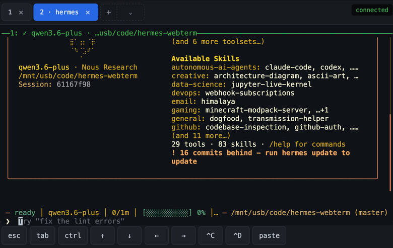

# hermes-webterm

A small web terminal for accessing the `hermes` CLI (or any command) from a browser on your LAN.

- **Server**: Bun (HTTP, WebSocket, frontend bundling)
- **Frontend**: xterm.js with a 4-digit PIN login and a Chrome-style tab strip for switching between sessions
- **Sessions**: backed by `tmux` — persist across browser disconnects and server restarts, with full scrollback
- **PTY**: a tiny Node child process per attached session (Node hosts `node-pty`; Bun handles everything else)



## Prerequisites

- [Bun](https://bun.com) (1.3+)
- `tmux` (`apt install tmux`)
- Node (for `node-pty`'s native module — `bun install` will rebuild it for you)

## Sessions

Each "session" is a real `tmux` session, named with a `hermes-` prefix
(`hermes-1`, `hermes-2`, ...). Sessions persist across browser disconnects
and server restarts — close your tab, come back tomorrow, scrollback intact.
Switch between them via the tab strip at the top of the page; ✕ kills a
session. If no sessions exist on connect, one is created automatically.

The new-session control is a split button:

- **`+`** runs whatever you set in `HERMES_CMD` (defaults to `hermes`).
- **`⌄`** opens a dropdown with every directory found in `~/.hermes/profiles/`
  (configurable via `HERMES_PROFILES_DIR`), plus a top-level `hermes` entry.
  Picking a profile runs `hermes -p <profile>` in a fresh tmux session; the
  profile name is shown next to the tab number (e.g. `3 · coder`) and is
  stashed on the tmux session itself, so it survives a server restart.

`tmux` must be installed (`apt install tmux` if needed).

## Setup

```bash
bun install
cp .env.example .env
# edit .env — at minimum set HERMES_PIN
```

`.env` keys:

| key | default | purpose |
| --- | --- | --- |
| `HERMES_PIN` | _(required, 4 digits)_ | PIN required to log in |
| `HERMES_CMD` | `hermes` | command run for the **`+`** button (e.g. set to `bash` if you want a quick shell) |
| `HERMES_ARGS` | _(empty)_ | space-separated args appended to `HERMES_CMD` |
| `HERMES_PROFILES_DIR` | `~/.hermes/profiles` | directory scanned for hermes profile sub-directories |
| `TMUX_SESSION_PREFIX` | `hermes-` | session name prefix (lets you have other tmux sessions co-existing) |
| `HOST` | `0.0.0.0` | bind address |
| `PORT` | `3003` | listen port |

## Run

```bash
bun run dev     # with hot reload
bun run start   # plain
```

Then open `http://<lan-ip>:3003/` from any device on your LAN, enter the PIN, and you're in.

## Auth

- 4-digit PIN, kept in `.env` (not committed).
- Sessions are random 32-byte tokens stored in memory; cookie is `HttpOnly`, `SameSite=Strict`, 24h.
- Rate limit: 5 wrong PINs per IP triggers a 30s lockout.
- Sessions are wiped on server restart — that's fine, just log in again.

## Files

| | |
| --- | --- |
| `server.ts` | Bun.serve — routes, WebSocket, cookie gate, session REST |
| `auth.ts` | PIN check, session map, rate limiter |
| `tmux.ts` | List / create / kill `hermes-*` tmux sessions via `tmux` CLI |
| `profiles.ts` | Lists hermes profile directories under `HERMES_PROFILES_DIR` |
| `pty.ts` | Spawns one `pty-host.cjs` per attached session, bridges I/O |
| `pty-host.cjs` | Node helper that runs `tmux attach -t <name>` inside `node-pty` |
| `login.html` / `login.ts` | PIN entry page |
| `terminal.html` / `terminal.ts` | xterm.js page with tab strip + mobile toolbar |

## Notes

- The Node child per session is the workaround for a Bun + `node-pty` incompatibility (the PTY exits with SIGHUP under Bun). Each session = one short-lived `node` process. Cheap enough on a Pi.
- Closing the browser tab kills the child process and the underlying `hermes` (or whatever you spawned).
- Mobile toolbar provides `esc`, `tab`, arrows, sticky `ctrl`, `^C`, `^D`, and `paste`.
- **iOS Safari is unreliable** for the WebSocket — the upgrade succeeds server-side but Safari often won't fire `onopen` until the page receives a user tap, and even then it's flaky. Use **Firefox Focus** or **Chrome iOS** on iPhone instead; both work first-time. (Firefox Focus has no bookmarks, sadly, so add the URL to your notes app or similar.)
